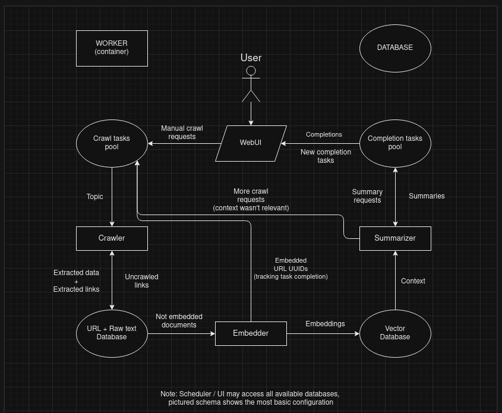

# ResearchChain

#### Langchain project aiming at achieving perpetual research with the help of a chain of ai researching agents.

- Install and launch Ollama: `ollama serve`
- Create new environment: `conda env create -n ResearchChain -f environment.yml`
- Activate the new environment: `conda activate ResearchChain`
- Pull the model you intend to use: `ollama pull zephyr:7b-beta-q5_K_M` (default)
- Pull an embedding model: `ollama pull nomic-embed-text` (default)
- Run: `python3 main.py`

#### Other notes

- The default models can be seen in the `core/models/configurations` folder. 
- We're using python version `3.9`
- `environment.yml` is the linux env, but for macOS (silicon) and windows there are other available
- Apple intel is not supported anymore, but you can still get it working by manually installing
  any missing package that comes up during the program execution.

### This is a monorepo for both a tool, and apps for it:

#### Research Chain
> A set of workers watching for new tasks 24/7. 
> This is the tool part of this project, alone it cannot schedule new tasks,
> unless as a side effect of a previous task.
> Consists of 3 infinitely scalable workers, which together with a 4th auto scheduling worker app,
> create a complete loop.
> This design allows for near infinite scalability potential.

#### Schedulers
> Built in examples of how to interact with Research Chain, the ones
> that we offer are WebUI, with plans for AutoScheduler and NewsScheduler coming soon. 
> These services automatically dispatch, analyze and manage Research Chain. 
> AutoScheduler and NewsScheduler should work alongside Web Interface, 
> to supply constant 24/7 knowledge and news analysis,
> and to expand its knowledge base by scheduling crawls based on the provided areas of interest.

### Flow of operations with WebUI app.

---
### Contributing

If you'd like to contribute to this project, 
feel free to reach out to us through my telegram: `https://t.me [slash] latkaignacy`. 
We'll introduce you into this project, 
fix any issues that you may encounter and help you find a good first issue. 
This is a great way to expand your portfolio, as there are nearly endless ways to expand this app,
that we already have planned, and many more which we don't :)

---

THIS SOFTWARE IS INTENDED FOR EDUCATIONAL AND RESEARCH PURPOSES ONLY.
WE ARE NOT RESPONSIBLE FOR ANY ILLICIT USES OF THIS SOFTWARE.
